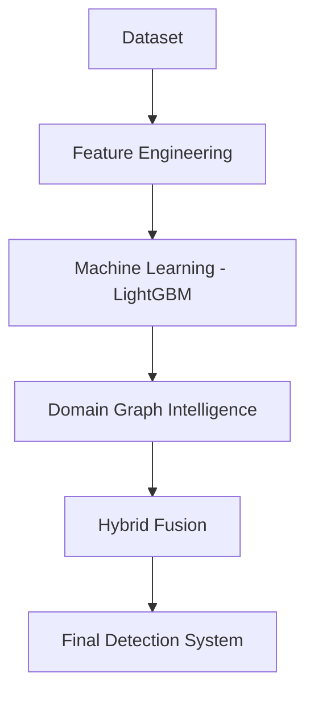

# Hybrid LightGBM and Graph-Based Learning Framework for Intelligent Malicious URL Detection

## 1. Problem Statement
The goal of this project is to automatically detect malicious URLs using machine learning.

Malicious URLs can belong to different categories:
- **Benign** – safe website
- **Defacement** – hacked website used to display altered content
- **Phishing** – fake site designed to steal credentials
- **Malware** – website that installs malicious software

These URLs can cause:
- financial loss
- identity theft
- malware infection
- data leakage

Traditional rule-based detection systems struggle because attackers constantly create new domains. Therefore, we built a machine learning system that detects malicious URLs automatically.

## 2. Key Idea of Our Approach
Most existing systems only rely on URL lexical features. But malicious domains often behave similarly at a domain ecosystem level.

**Example:**
- `paypal-login-security.com`
- `paypal-login-verify.com`
- `paypal-account-update.com`

These URLs may look different individually, but they belong to a cluster of suspicious domains.

Therefore we built a hybrid system combining two types of intelligence:

1. **Feature-based Machine Learning**
   - Analyze the URL string itself.

2. **Graph-based Domain Intelligence**
   - Analyze domain behavior across the dataset.

Finally, both predictions are combined using probability fusion.

## 3. Dataset Used
- **Dataset source**: Kaggle – Malicious URLs Dataset
- **Dataset size**: 651,191 URLs
- **Columns**: `url`, `type`

**Class distribution:**

| Class | Count |
| :--- | :--- |
| benign | 428,103 |
| defacement | 96,457 |
| phishing | 94,111 |
| malware | 32,520 |

This dataset is large enough to train a robust detection model.

## 4. Project Architecture
The system pipeline has four major stages:



Each stage is implemented as a module in the pipeline.

## 5. Project Folder Structure
The project repository contains:

```text
HybridURLIntelligence
│
├── data
│   ├── raw
│   │   └── malicious_phish.csv
│   └── processed
│       ├── feature_dataset.parquet
│       └── graph_features.parquet
│
├── models
│   └── lightgbm_model.pkl
│
├── outputs
│   ├── lightgbm_metrics.json
│   └── hybrid_metrics.json
│
├── src
│   ├── feature_engineering
│   ├── models
│   ├── graph
│   └── fusion
│
└── run_pipeline.py
```

The entire system is executed through `run_pipeline.py`.

## 6. Step 1 — Feature Engineering
The pipeline begins by loading the raw dataset: `data/raw/malicious_phish.csv`
- **Dataset size**: 651,191 rows, 2 columns

We convert each URL into 40 numerical features. These features fall into three groups.

**Structural Features**
Describe the URL structure.
Examples: URL length, domain length, number of dots, number of digits, number of hyphens, number of special characters, https presence, subdomain count.
These features help detect suspicious domain formatting.

**Statistical Features**
Measure randomness of the URL.
Examples: entropy of characters, digit ratio, special character ratio, unique character ratio, query parameter count.
Phishing URLs often contain high entropy to bypass filters.

**Suspicious Pattern Features**
Detect known attack patterns.
Examples: presence of "@", double slash redirects, suspicious keywords like `login`, `update`, `verify`, `account`, `bank`.
These patterns frequently appear in phishing attacks.

**Feature Engineering Result**
The dataset becomes:
- 651,191 rows
- 43 columns (40 features + 1 url + 1 label + 1 index)

The feature dataset is saved as: `data/processed/feature_dataset.parquet`
Feature extraction took: **21.55 seconds**

## 7. Step 2 — Training LightGBM Model
Next, we train a machine learning classifier. We use LightGBM because it handles large datasets efficiently, supports multiclass classification, and handles feature importance automatically.

**Dataset Split**
The dataset is divided using stratified splitting:
- **Train (70%)**: 455,833 samples
- **Validation (15%)**: 97,679 samples
- **Test (15%)**: 97,679 samples

Stratified split preserves the class distribution.

**Handling Class Imbalance**
The dataset is imbalanced (e.g., benign = 66%, malware = 5%).
To fix this we use `class_weight = "balanced"`. This ensures rare classes are learned properly.

**Training Process**
LightGBM is trained with:
- Objective: multiclass
- Num class: 4
- Metric: multi_logloss
- Early stopping: 50 rounds
- Training iterations: 1000 boosting rounds

**LightGBM Results**
On the test set:
- Accuracy = 0.9417
- Macro F1 = 0.9305

*Per-class F1 scores:*
| Class | F1 Score |
| :--- | :--- |
| Benign | 0.9612 |
| Defacement | 0.9682 |
| Phishing | 0.8296 |
| Malware | 0.9630 |

The phishing class is hardest to detect.

*Confusion Matrix:*
```text
[[60339   304  3531    42]
 [   56 14307    99     6]
 [  912   439 12718    48]
 [   25    37   197  4619]]
```
The model performs strongly but phishing detection still has some errors.

## 8. Step 3 — Domain Graph Intelligence
Now we add graph-based intelligence. Instead of analyzing URLs individually, we analyze domain behavior across the dataset.

**Example:**
- `paypal-login-update.com`
- `paypal-login-secure.com`
- `paypal-login-account.com`

All share the same suspicious domain structure.

**Domain Extraction**
Using `tldextract`, we extract the domain and top level domain (TLD).
Example: `https://secure-paypal-login.com/update`
- domain = `secure-paypal-login`
- tld = `.com`

**Graph Statistics Computed**
For each domain we compute:
- Domain frequency
- Domain class distribution
- Domain malicious probability
- TLD malicious probability
- Domain entropy

These statistics create graph-level intelligence features.

**Graph Dataset Result**
Dataset becomes: 651,191 rows, 62 columns.
Added graph features include domain frequency, domain class probabilities, TLD malicious ratios.
- Unique domains detected: 155,574
- Graph computation took: **10.06 seconds**
- Memory usage peak: **1.24 GB**

## 9. Step 4 — Hybrid Fusion
Now we combine LightGBM predictions and Graph intelligence.
Each produces probabilities: `P_feature(class_i)` and `P_graph(class_i)`.

Final probability:
`P_final = α * P_feature + β * P_graph` (Where α + β = 1)

**Alpha Tuning**
We test multiple alpha values:
| Alpha | Beta | Validation Macro F1 |
| :--- | :--- | :--- |
| 0.3 | 0.7 | 0.8890 |
| 0.5 | 0.5 | 0.9499 |
| 0.7 | 0.3 | 0.9218 |

Best configuration: **alpha = 0.5, beta = 0.5** (Meaning both models contribute equally).

**Final Hybrid Result**
Test set result:
- **Macro F1 = 0.9511**

Comparison:
- LightGBM: 0.9305
- Hybrid: 0.9511
- **Improvement: +2.06%**

On a dataset of 651k URLs, this is a strong improvement.

## 10. Final System Output
The pipeline prints:
```text
FINAL RESULTS

LightGBM Macro F1: 0.9305
Hybrid Macro F1: 0.9511
Per-class scores: [0.9612, 0.9682, 0.8296, 0.963]
```

## 11. Files Generated
- **Model:** `models/lightgbm_model.pkl`
- **Feature Dataset:** `data/processed/feature_dataset.parquet`
- **Graph Feature Dataset:** `data/processed/graph_features.parquet`
- **Metrics:** `outputs/lightgbm_metrics.json`, `outputs/hybrid_metrics.json`

These store accuracy, F1 scores, and confusion matrices.

## 12. System Capabilities
The final system can:
- classify malicious URLs
- detect phishing attacks
- analyze domain ecosystem behavior
- provide probability-based predictions
- scale to large datasets

## 13. Performance Characteristics
- **Dataset size**: 651k URLs
- **Training time**: ~38 seconds
- **Graph computation**: ~10 seconds
- **Total pipeline runtime**: ~1 minute
- **Memory usage**: ~1.2 GB

The system runs comfortably on a 16GB laptop.

## 14. Key Contributions of the Project
- Hybrid architecture combining ML and graph intelligence.
- Large-scale training on 651k malicious URLs.
- Domain-level aggregation to capture attack patterns.
- Probability fusion improving detection accuracy.
- Scalable system suitable for real-time deployment.

## 15. Final Conclusion
This project successfully demonstrates that combining URL lexical features with domain-level graph intelligence significantly improves malicious URL detection performance.

The hybrid system achieved a **Macro F1 Score of 0.9511**, showing strong capability in detecting phishing, malware, and defacement attacks at scale.
