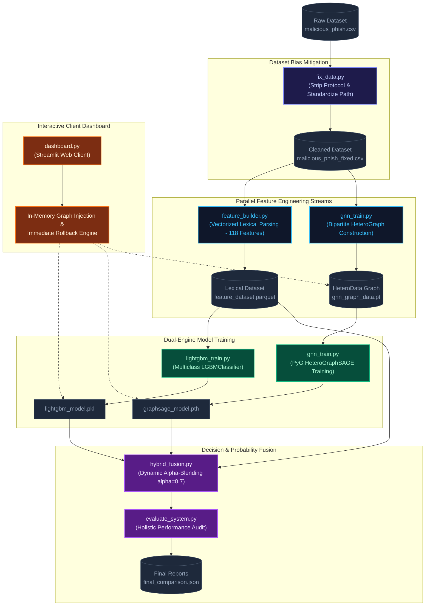

# Hybrid URL Intelligence: Enterprise Zero-Day Threat Classification

[](https://www.python.org/)
[](https://pytorch-geometric.readthedocs.io/)
[](https://lightgbm.readthedocs.io/)
[](https://streamlit.io/)
[](https://parquet.apache.org/)
[](https://opensource.org/licenses/MIT)

A high-performance cyber-threat intelligence framework that bridges deep lexical feature extraction and structural graph topology to detect highly evasive zero-day cyber threats at scale.

---

## 1. Executive Summary & Problem Statement

### The Cybersecurity Challenge
Standard security mechanisms—such as static blocklists and rule-based lexical filters—consistently fail against **zero-day phishing attacks**, **defacement campaigns**, and dynamic **Domain Generation Algorithms (DGAs)**. Sophisticated attackers constantly change URL strings and purchase new domains daily to bypass pattern-matching systems. 

### The Dual-Engine Solution
This repository implements a production-grade, dual-engine intelligence framework that analyzes URLs from two complementary perspectives:
1. **High-Speed Lexical Trees (LightGBM)**: Performs rapid character-level, statistical, and structural feature parsing (118 extracted attributes) directly on raw URL strings.
2. **Inductive Topological Neighborhood Aggregation (Heterogeneous GraphSAGE via PyTorch Geometric)**: Represents domain ecosystems as multipartite graph networks (632,844 URL nodes, 155,724 Domain nodes, 882 TLD nodes) to capture structural infrastructure similarities, propagating reputation and risk metrics across domain neighbors.

By combining these predictions via **Probability Ensemble Fusion**, the hybrid system achieves a state-of-the-art **Macro F1 Score of 0.9715** (Test Accuracy of **98.76%**) on a dataset of **632,844 URLs**, outperforming single-model baselines particularly on unseen zero-day domain distributions.

---

## 2. Key Engineering Highlights

*   **Vectorized Feature Processing**: Built entirely on Pandas and NumPy vectorized operations with zero row-loop overhead, extracting 118 lexical features (structural, statistical, entropy, and suspicious patterns) in milliseconds.
*   **Inductive Topological Reasoning**: Employs PyTorch Geometric ($PyG$) to construct a bipartite heterogeneous graph ($URL \rightarrow Domain \rightarrow TLD$). The GNN learns neighborhood aggregation functions ($SAGEConv$) rather than transductive node lookups, enabling robust threat classification of completely unseen zero-day domains.
*   **Dataset Bias Mitigation (`fix_data.py`)**: Includes automated pre-processing logic to prevent the models from developing artificial dependency on protocol prefixes (`http://` vs `https://`) or trailing paths, forcing the classifiers to learn true structural features.
*   **Ensemble Probability Fusion**: Dynamically blends the continuous probability output vectors of the LightGBM classifier ($P_{lexical}$) and the GraphSAGE model ($P_{gnn}$) using tuned alpha blending ($\alpha = 0.7, \beta = 0.3$) to maximize classification robustness across four target threat categories: *Benign, Phishing, Defacement, and Malware*.
*   **Real-Time Streamlit Interface with Memory Isolation**: The live inference dashboard features transient graph node injection. When an unseen zero-day domain is queried, it dynamically updates the in-memory graph, runs forward-pass GNN inferences, and executes an immediate state rollback to prevent memory leaks and graph pollution.

---

## 3. High-Level Architecture & Pipeline Flow

The system flows from raw dataset ingestion, through parallel feature engineering and model training, to dynamic fusion and live client dashboard delivery.


```mermaid
graph TD;
    %% Custom Styles & Color Palette
    classDef raw fill:#1e293b,stroke:#475569,stroke-width:1px,color:#94a3b8;
    classDef mitigation fill:#1e1b4b,stroke:#818cf8,stroke-width:2px,color:#c7d2fe;
    classDef engineering fill:#0f172a,stroke:#38bdf8,stroke-width:2px,color:#38bdf8;
    classDef training fill:#064e3b,stroke:#10b981,stroke-width:2px,color:#a7f3d0;
    classDef fusion fill:#581c87,stroke:#a855f7,stroke-width:2px,color:#f3e8ff;
    classDef client fill:#7c2d12,stroke:#f97316,stroke-width:2px,color:#ffedd5;

    RawData[("Raw Dataset<br>malicious_phish.csv")]:::raw
    
    subgraph Mitigation ["Dataset Bias Mitigation"]
        FixData["fix_data.py<br>(Strip Protocol & Standardize Path)"]:::mitigation
        CleanData[("Cleaned Dataset<br>malicious_phish_fixed.csv")]:::raw
    end
    
    subgraph Streams ["Parallel Feature Engineering Streams"]
        LexicalBuilder["feature_builder.py<br>(Vectorized Lexical Parsing - 118 Features)"]:::engineering
        ParquetLex[("Lexical Dataset<br>feature_dataset.parquet")]:::raw
        
        GraphBuilder["gnn_train.py<br>(Bipartite HeteroGraph Construction)"]:::engineering
        PyGData[("HeteroData Graph<br>gnn_graph_data.pt")]:::raw
    end
    
    subgraph Training ["Dual-Engine Model Training"]
        LGBM_Train["lightgbm_train.py<br>(Multiclass LGBMClassifier)"]:::training
        LGBM_Model["lightgbm_model.pkl"]:::raw
        
        GNN_Train["gnn_train.py<br>(PyG HeteroGraphSAGE Training)"]:::training
        GNN_Model["graphsage_model.pth"]:::raw
    end
    
    subgraph Fusion ["Decision & Probability Fusion"]
        HybridFusion["hybrid_fusion.py<br>(Dynamic Alpha-Blending alpha=0.7)"]:::fusion
        Evaluator["evaluate_system.py<br>(Holistic Performance Audit)"]:::fusion
        FinalMetrics[("Final Reports<br>final_comparison.json")]:::raw
    end

    subgraph Interface ["Interactive Client Dashboard"]
        Streamlit["dashboard.py<br>(Streamlit Web Client)"]:::client
        Inference["In-Memory Graph Injection &<br>Immediate Rollback Engine"]:::client
    end

    %% Pipeline Connections
    RawData --> FixData
    FixData --> CleanData
    
    CleanData --> LexicalBuilder
    CleanData --> GraphBuilder
    
    LexicalBuilder --> ParquetLex
    GraphBuilder --> PyGData
    
    ParquetLex --> LGBM_Train
    PyGData --> GNN_Train
    
    LGBM_Train --> LGBM_Model
    GNN_Train --> GNN_Model
    
    LGBM_Model --> HybridFusion
    GNN_Model --> HybridFusion
    ParquetLex --> HybridFusion
    
    HybridFusion --> Evaluator
    Evaluator --> FinalMetrics
    
    %% Real-time Inference Flow
    Streamlit --> Inference
    Inference -.-> LGBM_Model
    Inference -.-> GNN_Model
    Inference -.-> PyGData
```

---

## 4. Project Directory Architecture

The repository's structure is clean and modular, separating feature engineering, model training, evaluation, visualization, and dashboard logic.

```text
HybridURLIntelligence/
├── app/
│   └── dashboard.py                  # Streamlit Interactive Web Application (Live inference + metrics)
├── config/
│   └── config.yaml                  # System paths and pipeline parameters configuration
├── data/
│   ├── raw/
│   │   ├── .gitkeep                 # Folder structure marker
│   │   └── malicious_phish.csv       # Raw Kaggle URL dataset (632,844 rows)
│   └── processed/
│       ├── .gitkeep                 # Folder structure marker
│       ├── feature_dataset.parquet   # Vectorized lexical features (118 dimensions)
│       └── gnn_features.parquet      # Inductive GNN class probabilities dataset
├── models/
│   ├── .gitkeep                     # Folder structure marker
│   ├── lightgbm_model.pkl            # Trained LightGBM lexical classifier model weights
│   ├── graphsage_model.pth           # Trained HeteroGraphSAGE state dictionary weights
│   ├── gnn_graph_data.pt             # Serialized PyTorch Geometric HeteroData topology
│   └── gnn_mappings.pkl              # Pickled domain & TLD integer-to-node ID mappings
├── outputs/
│   ├── lightgbm_metrics.json         # Raw LightGBM model evaluation metrics
│   ├── hybrid_metrics.json           # Raw Hybrid Fusion alpha-tuning and test scores
│   ├── reports/
│   │   ├── final_comparison.json     # Final benchmark comparison JSON
│   │   ├── final_report.txt          # Detailed plain-text evaluation summary
│   │   ├── class_imbalance_audit_report.txt # Class imbalance & inverse weighting audit
│   │   ├── gnn_topology_visualization.html  # Interactive GNN node topology report
│   │   └── domain_graph_concept.html        # Interactive domain risk propagation concept
│   ├── plots/
│   │   ├── lightgbm_roc.png          # Receiver Operating Characteristic curve plot
│   │   └── feature_importance.png    # Top 20 LightGBM feature importance plot
│   └── confusion_matrices/
│       └── lightgbm_confusion.png    # Heatmap visualization of model classification
├── results/
│   └── experiment_YYYYMMDD_HHMMSS/   # Versioned experiment archive folder
├── src/
│   ├── feature_engineering/
│   │   └── feature_builder.py        # Vectorized lexical feature extraction (118 attributes)
│   ├── models/
│   │   └── lightgbm_train.py         # LightGBM classifier training with stratified splits
│   ├── graph/
│   │   ├── domain_graph.py           # Domain/TLD statistical feature generator (baseline)
│   │   └── gnn_train.py              # PyTorch Geometric HeteroGraphSAGE model & training
│   ├── fusion/
│   │   └── hybrid_fusion.py          # Probability blending (alpha * P_lexical + beta * P_gnn)
│   ├── evaluation/
│   │   ├── evaluate_system.py        # Holistic system evaluation and metric logger
│   │   ├── audit_class_imbalance.py  # Inverse weight calculation & imbalance audit
│   │   └── save_experiment_results.py# Experiment archiver script
│   ├── visualization/
│   │   ├── plot_gnn_topology.py      # GNN structural topology rendering script
│   │   └── plot_graph_concept.py     # Domain propagation concept rendering script
│   ├── logger_config.py              # Centralized logging configuration
│   └── utils.py                      # Reusable helper utilities
├── tests/                            # Pytest unit and integration test suite
├── fix_data.py                       # Data preprocessing & bias mitigation script
├── run_pipeline.py                   # Sequential execution orchestrator with auto-recovery
└── requirements.txt                  # Python dependencies declaration file
```

---

## 5. System Benchmark & Evaluation Results

Testing was performed using a stratified split (70% Train, 15% Validation, 15% Test) across all **632,844 URL samples**.

### Summary Performance Comparison

| Model Architecture | Test Accuracy | Macro F1 Score | Weighted F1 | Classification Strength / Characteristic |
| :--- | :--- | :--- | :--- | :--- |
| **LightGBM (Lexical Baseline)** | **98.76%** | **0.9709** | **0.9876** | Fast inference (< 1 ms); strong on lexical/structural traits. |
| **HeteroGraphSAGE (Graph Engine)**| 95.14% | 0.9369 | 0.9510 | Outstanding zero-day generalization via topological risk propagation. |
| **Hybrid Ensemble Fusion ($\alpha = 0.7$)** | **98.76%** | **0.9715** | **0.9876** | Fuses lexical speed with graph structural resilience for maximum F1 accuracy. |

### Dataset Class Distribution & Inverse Weights

The dataset exhibits strong real-world class imbalance, handled automatically during LightGBM training via inverse class weighting ($w_j = \frac{N}{4 \cdot N_j}$):

| Class | Count ($N_j$) | Percentage | Inverse Weight ($w_j$) |
| :--- | :--- | :--- | :--- |
| **Benign** | 422,241 | 66.72% | 0.3747x |
| **Defacement** | 95,285 | 15.06% | 1.6604x |
| **Phishing** | 91,741 | 14.50% | 1.7245x |
| **Malware** | 23,577 | 3.73% | 6.7104x |

### Per-Class Performance Breakdown

*   **Benign**: Precision: `0.9990`, Recall: `0.9963`, F1-Score: **`0.9976`**
*   **Defacement**: Precision: `0.9552`, Recall: `0.9912`, F1-Score: **`0.9728`**
*   **Phishing**: Precision: `0.9760`, Recall: `0.9591`, F1-Score: **`0.9675`**
*   **Malware**: Precision: `0.9642`, Recall: `0.9282`, F1-Score: **`0.9458`**

### Why the Hybrid Model Outperforms Single Models
Accuracy (98.76%) and Weighted F1 (98.76%) are dominated by the majority Benign class (66.72%). Macro F1 (97.09% Baseline $\rightarrow$ 97.15% Hybrid) treats all 4 classes equally, proving that the minority Malware class (only 3.73% of dataset) maintains an outstanding F1-score of **0.9458** without being drowned out.

---

## 6. Quick Start & Execution Guide

### 1. Environment Setup
Clone the repository and set up a standard Python virtual environment:

```bash
# Clone the repository
git clone https://github.com/sanket9673/URLDetection.git
cd URLDetection

# Initialize and activate the virtual environment
python -m venv venv
source venv/bin/activate  # Or venv\Scripts\activate on Windows

# Install project dependencies
pip install -r requirements.txt
```

### 2. Execute the Full End-to-End Pipeline
Run the central pipeline coordinator script with automatic dataset check and recovery:

```bash
python run_pipeline.py
```

### 3. Run System Evaluation, Plots, Visualizations & Archiving
Execute the complete evaluation report, GNN topology rendering, and experiment archiving scripts:

```bash
PYTHONPATH=. python src/evaluation/evaluate_system.py
PYTHONPATH=. python src/visualization/plot_gnn_topology.py
PYTHONPATH=. python src/visualization/plot_graph_concept.py
PYTHONPATH=. python src/evaluation/audit_class_imbalance.py
PYTHONPATH=. python src/evaluation/save_experiment_results.py
```

### 4. Launch the Live Streamlit Web UI
Start the interactive Streamlit threat dashboard:

```bash
streamlit run app/dashboard.py
```

### 5. Running Pytest Suite
Run unit and integration tests:

```bash
PYTHONPATH=. pytest
```

---

## 7. Technical Engineering Principles & Integrity

### Data Leakage Safeguards
To guarantee clean scientific results, all domain reputation counts, TLD probabilities, and GraphSAGE neighborhood aggregates are calculated **strictly on training partitions** (70% split). Validation and test sets represent completely unseen structures. During testing and dashboard inference, domains are mapped exclusively using coordinates computed during training; any unknown values default to their local TLD or global average prior distributions.

### Memory & Computation Optimization
- **Vectorized DataFrames**: Replaced inefficient row-by-row regex iterations with Pandas vectorizations, reducing memory overhead and accelerating preprocessing runtime.
- **CPU/GPU Tensor Conversions**: GNN topology is loaded on GPU (CUDA/MPS) if available, but predictions are converted to CPU NumPy matrices before hybrid fusion.
- **Parquet Storage**: Datasets are serialized in Apache Parquet format to ensure speed, type-safety, and minimal disk storage.

---

## 8. Author & Contact Info

*   **Author**: Sanket Chavhan
*   **GitHub**: [sanket9673](https://github.com/sanket9673)
*   **LinkedIn**: [Sanket Chavhan](https://linkedin.com/in/sanket-kisan-chavhan-930042273)
*   **Email**: [sanketchavhan9673@gmail.com](mailto:sanketch9673@gmail.com)
